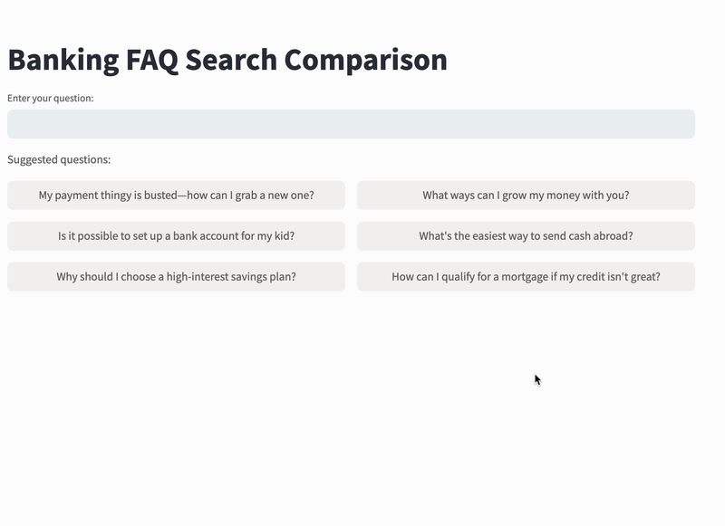

# Rerank vs Lexical Search Demo (Retail Banking)
This demo compares traditional lexical search (BM25) with Cohere Rerank 3, demonstrating modern search capabilities in a retail banking context.

The interface displays parallel results from both methods, allowing direct comparison of their effectiveness in understanding and ranking banking-related queries.
